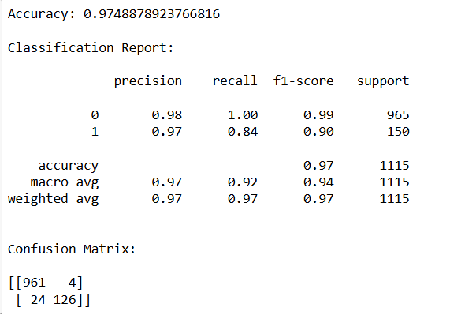

# Implementation-of-SVM-For-Spam-Mail-Detection

## AIM:
To write a program to implement the SVM For Spam Mail Detection.

## Equipments Required:
1. Hardware – PCs
2. Anaconda – Python 3.7 Installation / Jupyter notebook

## Algorithm
1.Import the packages.

2.Analyse the data.

3.Use modelselection and Countvectorizer to preditct the values.

4.Find the accuracy and display the result.
## Program:
```
/*
Program to implement the SVM For Spam Mail Detection..
Developed by: V.Siri sai
RegisterNumber: 212225240181 
*/
import pandas as pd
from sklearn.model_selection import train_test_split
from sklearn.feature_extraction.text import TfidfVectorizer
from sklearn.svm import SVC
from sklearn.metrics import accuracy_score, classification_report, confusion_matrix

data = pd.read_csv("C:/Users/acer/Downloads/spam.csv",encoding="latin-1")

data = data[['v1', 'v2']]
data.columns = ['label', 'message']

data['label'] = data['label'].map({'ham': 0, 'spam': 1})

X = data['message']
y = data['label']

vectorizer = TfidfVectorizer(stop_words='english')
X = vectorizer.fit_transform(X)

X_train, X_test, y_train, y_test = train_test_split(
    X, y, test_size=0.2, random_state=42
)

model = SVC(kernel='linear')
model.fit(X_train, y_train)

y_pred = model.predict(X_test)

print("Accuracy:", accuracy_score(y_test, y_pred))
print("\nClassification Report:\n")
print(classification_report(y_test, y_pred))

cm = confusion_matrix(y_test, y_pred)
print("\nConfusion Matrix:\n")
print(cm)
```

## Output:



## Result:
Thus the program to implement the SVM For Spam Mail Detection is written and verified using python programming.
